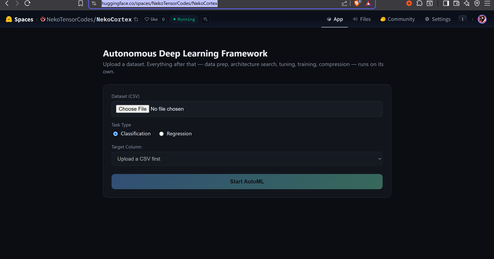

<div align="center">

# 👾 NekoCortex — Backend 🌿

### The actual AutoML pipeline: FastAPI + PyTorch, streamed live over WebSocket

[**Live API**](https://nekotensorcodes-nekocortex.hf.space) · [Frontend Repo](https://github.com/NekoTensor/AutoML-Frontend) · [Live Site](https://nekocortex.vercel.app/)

</div>

<br/>



<br/>

## What this is

This is the real pipeline behind NekoCortex — not a mocked backend. Upload a CSV, and this service actually:

1. **Validates the dataset** — row/feature counts, class-balance detection, and synthetic oversampling (a from-scratch SMOTE-style k-NN interpolation) for imbalanced classification targets
2. **Searches architectures** — trains and ranks a shortlist of MLP architectures (varying depth/width/activation/dropout)
3. **Tunes hyperparameters** — Optuna's TPE sampler (or plain random search if Optuna isn't installed) across learning rate, dropout, and batch size, 25 trials
4. **Trains for real** — full epoch-by-epoch training with live overfitting detection (a rolling-window trend check, not a naive consecutive-epoch rule) that adjusts dropout/LR mid-run, and automatically restores the best checkpoint seen — not just whatever the final epoch produced
5. **Compresses the model** — real `torch.nn.utils.prune` magnitude pruning, a knowledge-distillation pass, and dynamic int8 quantization, then exports to ONNX

Every phase streams live progress over a WebSocket (`/ws/run`) to the [frontend](https://github.com/NekoTensor/AutoML-Frontend). At the end, the API serves three downloadable artifacts: the ONNX model, a full JSON report, and a self-contained Jupyter notebook that embeds each phase's actual source code alongside that specific run's real results.

## Architecture

```
app.py                       # FastAPI: /api/upload, job registry, /ws/run + /ws/attach, cancel, downloads, CORS
src/
├── orchestrator.py          # calls phases 1→5 in order, builds the final report + notebook
├── notebook_export.py       # packages one run into a self-contained .ipynb
└── phases/
    ├── phase1_data.py       # validation, class-balance check, synthetic oversampling
    ├── phase2_nas.py        # architecture search over a small MLP search space
    ├── phase3_hpo.py        # Optuna TPE hyperparameter search (or random-search fallback)
    ├── phase4_train.py      # training loop, best-checkpoint tracking, overfit detection
    └── phase5_compress.py   # pruning → distillation → quantization → ONNX export
```

Each phase is a single `run(..., progress=None)` function — `progress` is a callback invoked throughout with small JSON-serializable events, which `app.py` forwards straight to the browser over the websocket. `orchestrator.py` is the only file that knows all five phases exist; nothing else needs to change if you swap out one phase's internals for a heavier search strategy later.

## Jobs outlive their websocket

A run used to live entirely inside the websocket handler, which made the socket *be* the job: closing the tab orphaned a pipeline that kept burning CPU with nobody listening, and a reload could never get back to it. Runs are now owned by an in-process registry keyed by `job_id`, with the socket demoted to one of possibly-several subscribers. That single change is what makes two things expressible:

| | |
|---|---|
| `WS /ws/run` | start a job and stream it |
| `WS /ws/attach/{job_id}` | re-attach to a job already in flight |
| `POST /api/cancel/{job_id}` | stop a running job |
| `GET /api/job/{job_id}` | job status — `running`, `complete`, `error`, `cancelled`, or `unknown` |
| `GET /health` | liveness probe, useful for waking a sleeping Space |

- **Cancel** is cooperative: it sets a flag that the pipeline's `progress` callback checks, so the run unwinds at its next epoch or trial. There's no safe way to kill a thread mid-tensor-op, and every phase reports progress often enough that the delay is at most one trial.
- **Resume** works because every event a job emits is kept in an ordered log. `/ws/attach/{job_id}` replays that log before following the run live, so a client that reloads mid-run re-attaches with nothing but the `job_id` and ends up in exactly the state it would have been in had it never disconnected.

The registry is deliberately in-process and retains the most recent `MAX_RETAINED_JOBS` runs — this service already assumes a single worker, and a Redis-backed registry would be scaffolding for a scale it doesn't have.

## This service is API-only

`/` used to serve `static/index.html`, a complete second frontend written in vanilla JS. Maintaining two independent UIs for one product means they drift the moment either side changes — and the static one was already behind. The [Next.js app](https://github.com/NekoTensor/AutoML-Frontend) is now the only frontend; `/` redirects to it, and `FRONTEND_URL` overrides the target. `static/index.html` is kept as a reference and is no longer mounted.

## Setup (local)

```bash
git clone https://github.com/NekoTensor/AutoML-Backend.git
cd AutoML-Backend
python -m venv venv
source venv/bin/activate    # Windows: venv\Scripts\Activate.ps1
pip install -r requirements.txt
uvicorn app:app --reload --port 8000
```

Requires Python 3.10+.

## Deployment

Deployed on a **Hugging Face Space** (Docker SDK) — see the `Dockerfile` and the YAML frontmatter at the top of this README's HF-Space copy for the required `sdk: docker` / `app_port: 7860` config.

- **CORS**: set `ALLOWED_ORIGINS` as a Space variable to your deployed frontend's exact URL (defaults to `*` if unset — fine for local dev, not for production)
- **Free-tier realities**: the Space sleeps after inactivity (~30-60s to wake on the next request), and its filesystem is ephemeral — uploads/models are wiped on restart, which is fine given the workflow is upload → process → download in one sitting

### Continuous deployment

This repo's `main` branch auto-deploys to the live Space on every merge, via `.github/workflows/sync-to-hf.yml` — Hugging Face Spaces don't watch GitHub natively, so this Action pushes `main` to the Space's own git remote whenever it changes. See `CONTRIBUTING.md` for the required repo secrets (`HF_TOKEN`, `HF_USERNAME`, `HF_SPACE_NAME`) and the full contributor flow.

## What's real vs. simplified

Every number this pipeline produces is a genuine training result — nothing is scripted or faked. That said, a few things are intentionally lightweight so a full run finishes in a few minutes on free-tier CPU instead of hours on a GPU cluster:

- **NAS** searches a fixed shortlist of 6 architectures, not an open-ended differentiable/evolutionary search
- **HPO** runs 25 Optuna trials, not a fully exhaustive Bayesian search
- **Synthetic oversampling** is written from scratch (k-NN interpolation) rather than using `imbalanced-learn`, to avoid an extra dependency — and it's tuned for binary classification; a 3-class imbalanced target (tested with Titanic's `Embarked` column) runs without crashing but hasn't been rigorously validated for multi-class targets
- **ONNX export** ships the pruned + distilled fp32 graph, not the quantized graph — PyTorch's dynamic-quantized linear ops have inconsistent ONNX opset support

## Known gaps

- **No automated tests.** Every bug found so far — a recurring NaN-JSON-serialization crash (Titanic's missing `Age`/`Cabin`/`Embarked` values), a missing `onnxscript` dependency, a Next.js CVE, a couple of hand-edit indentation mistakes — was caught by manually triggering the failure and reading the traceback, not by CI. A test suite covering `phase1_data.py`'s NaN handling alone would have caught the recurrence of that specific bug.
- **Single active job at a time** (`ThreadPoolExecutor(max_workers=2)`) — no queueing, not built for concurrent multi-user load.
- **No job persistence** — everything lives in memory per websocket connection and on the Space's ephemeral disk.
- **"Run Inference" endpoint doesn't exist yet** — the ONNX model is fully valid and downloadable, but there's no `/api/predict` route to load it back and serve predictions.

## License

MIT — see `LICENSE`.

## Contributing

See `CONTRIBUTING.md`. Public repo, PRs welcome — a test suite for the phases would be an especially valuable first contribution.
